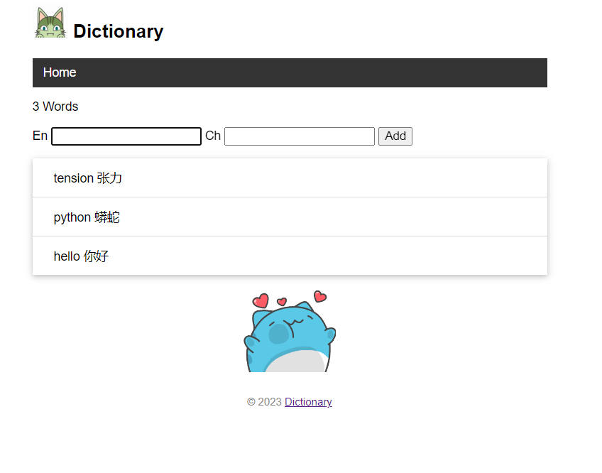

# dictionary（建设中）

## 简介

- 一个用于记录英语单词的程序
- 项目使用 `flask` 框架，数据库使用 `SQLAlchemy`
- 英语单词有中英文注释，和百度翻译的连接 (未实现)
- 对单词可进行三种操作：删除、修改、添加 (只实现了添加)
- 可对所有单词进行乱序的测试功能 (未实现)

## 运行

**激活虚拟环境**

在文件目录下，使用下面命令来激活虚拟环境

```
$ env\Scripts\activate  # Windows
```

> **提示** 如果你在 Windows 中使用 Git Bash，则需要使用`. env/Scripts/activate` 命令

或：

```
$ . env/bin/activate  # Linux 或 macOS
```

这时命令提示符前会显示虚拟环境的名称，表示已经激活成功：

```
(env) $
```

在激活虚拟环境后，无论操作系统和 Python 版本，都可以统一使用 `python` 和 `pip` 命令来调用当前虚拟环境内的 Python 和 pip 程序/二进制文件。此时执行 `python` 或 `pip` 命令指向的程序和激活脚本在同一个目录下，在 Windows 下所在目录为 `env\Scripts\`，Linux 和 macOS 下所在目录为 `env/bin/`。

最后，执行 `deactivate` 即可退出虚拟环境：

```
(env) $ deactivate
$
```

**初始化**

确保当前是项目的根目录，并且激活了虚拟环境，然后在命令行窗口执行 `flask init` 初始化数据库：

```
(env) $flask init
```

**打开主页**

确保当前是项目的根目录，并且激活了虚拟环境，然后在命令行窗口执行 `flask run` 命令启动程序（按下 Control + C 可以退出）：

```
(env) $ flask run
* Serving Flask app "app.py"
* Environment: production
  WARNING: Do not use the development server in a production environment.
  Use a production WSGI server instead.
* Debug mode: off
* Running on http://127.0.0.1:5000/ (Press CTRL+C to quit)
```

现在打开浏览器，输入 [http://localhost:5000](http://localhost:5000/) 并按下 Enter 即可访问程序主页。

**运行效果**



## 日志

* 23/10/4 添加了程序主页，增添单词的功能
